<div align="center">


<a href="https://www.linkedin.com/in/selvaganapathi-s-a4b385324/">
  
</a>

<br/>

<a href="https://www.linkedin.com/in/selvaganapathi-s-a4b385324/"></a>
<a href="mailto:selvaganapathysrinivasan212k5@gmail.com"></a>
<a href="#"></a>


</div>

<br/>

## 🚀 About Me

I specialize in engineering **scalable software systems and intelligent networking solutions**. My work sits at the intersection of **software engineering, distributed cloud systems, and machine learning** — with a specific focus on **Software-Defined Networking (SDN)**.

```yaml
current_focus: "SDN-based Dynamic Bandwidth Allocation System using LSTM"
full_stack:    "Modern web & desktop apps with real-time updates"
research:      "Network congestion prediction, dynamic flow rules, traffic optimization"
exploring:     "AI-driven cloud automation, high-throughput backend architecture"
```

<br/>

## 🛠️ Tech Stack

<div align="center">

**Languages & Core**
<br/>


**Frontend & UI**
<br/>


**Backend & Databases**
<br/>


**Cloud, DevOps & Networking**
<br/>


</div>

<br/>

## 🧩 Featured Projects

<table width="100%">
  <tr>
    <td width="50%" valign="top">
      <h3>🌐 SDN Hybrid QoS System</h3>
      <p>Intelligent bandwidth management and traffic classification engine powered by deep learning.</p>
      <ul>
        <li><b>Dynamic Flow Rules</b> — Automated Ryu controller decisions</li>
        <li><b>Congestion Prediction</b> — LSTM-backed load forecasting</li>
        <li><b>DSCP Handling</b> — Real-time QoS flow prioritization</li>
      </ul>
      <p>
        
        
        
        
      </p>
      <details>
        <summary>🔗 Links &amp; Sources</summary>
        <br/>
        <p>
          <a href="#">📂 Source Code</a><br/>
          <a href="#">📄 Documentation / Report</a>
        </p>
      </details>
    </td>
    <td width="50%" valign="top">
      <h3>🍽️ Restaurant Seat Booking System</h3>
      <p>Full-stack reservation portal featuring live seating updates and pre-ordering integration.</p>
      <ul>
        <li><b>Real-time Sync</b> — WebSockets for instant table availability</li>
        <li><b>Streamlined Checkout</b> — Integrated payment gateway</li>
        <li><b>Modern UX</b> — Clean interface built for seamless ordering</li>
      </ul>
      <p>
        
        
        
        
      </p>
      <details>
        <summary>🔗 Links &amp; Sources</summary>
        <br/>
        <p>
          <a href="#">📂 Source Code</a><br/>
          <a href="#">📄 Documentation / Report</a>
        </p>
      </details>
    </td>
  </tr>
  <tr>
    <td width="50%" valign="top">
      <h3>📦 Kubernetes Visualization Tool</h3>
      <p>Lightweight visual dashboard for tracking cluster workloads and monitoring resource health.</p>
      <ul>
        <li><b>Hierarchy View</b> — Interactive Pod &amp; ReplicaSet maps</li>
        <li><b>Telemetry</b> — Real-time CPU and memory metric tracking</li>
        <li><b>Namespace Scope</b> — Multi-tenant cluster isolation monitoring</li>
      </ul>
      <p>
        
        
        
        
      </p>
      <details>
        <summary>🔗 Links &amp; Sources</summary>
        <br/>
        <p>
          <a href="#">📂 Source Code</a><br/>
          <a href="#">📄 Documentation / Report</a>
        </p>
      </details>
    </td>
    <td width="50%" valign="top">
      <h3>⚡ AI-Driven Network Automation</h3>
      <p>Experimental framework for applying machine learning models to distributed network routing.</p>
      <ul>
        <li><b>Packet Telemetry</b> — Deep packet extraction with tcpdump/iperf</li>
        <li><b>Optimization</b> — Predictive dynamic queue allocation</li>
      </ul>
      <p>
        
        
        
      </p>
      <details>
        <summary>🔗 Links &amp; Sources</summary>
        <br/>
        <p>
          <a href="#">📂 Source Code</a><br/>
          <a href="#">📄 Documentation / Report</a>
        </p>
      </details>
    </td>
  </tr>
</table>

<br/>

## 📊 Live Analytics & Activity

<div align="center">


<br/>



<br/>


<br/>


</div>

> 🔄 **These widgets stay current automatically.** Stats, streaks, and the activity graph pull live from the GitHub API on every page load. The Top Languages card is generated once a day by a GitHub Action into `profile/top-langs.svg` (setup below) — this makes it immune to the shared stats API's rate limits, which is what was causing it to fail to render.

<details>
<summary><b>⚙️ One-time setup for the Top Languages card</b></summary>
<br/>

1. Add `top-langs.yml` (provided alongside this README) to `.github/workflows/` in this repo.
2. Push to `main`, or run the workflow manually from the **Actions** tab.
3. It creates `profile/top-langs.svg` and commits it automatically — no tokens or secrets to add, `GITHUB_TOKEN` is provided by GitHub Actions by default.
4. The card then re-generates on its own every day at midnight UTC.

</details>

<br/>

<details>
<summary><b>🐍 Contribution Snake (click to see setup)</b></summary>
<br/>

This repo can host an animated "snake" that eats through your contribution graph, regenerated daily by GitHub Actions.

1. Create `.github/workflows/snake.yml` in this repo (sample provided alongside this README).
2. Push to `main` — the workflow generates `dist/github-contribution-grid-snake.svg`.
3. Embed it here with:
   ```md
   
   ```

</details>

<br/>

## 🎯 Quick Stats

<div align="center">

| 🎓 Degree | 💼 Focus | 🌱 Learning | 📫 Reach Me |
|:---:|:---:|:---:|:---:|
| B.Tech IT | SDN + Full-Stack | LSTM Networking Models | [Email](mailto:selvaganapathysrinivasan212k5@gmail.com) |

</div>

<br/>

## ⚡ Fun Fact

> I love combining **network engineering and deep learning** to solve scalability bottlenecks that traditional static rules can't fix.

<br/>

<div align="center">


<sub>Designed &amp; Developed by <b>Selvaganapathi S</b> • Last profile refresh happens live via GitHub-hosted widgets above</sub>

</div>
